---
## Front matter
lang: ru-RU
title: Лабораторная работа 3
author:
  - Петрушов Дмитрий, 1032212287
institute:
  - Российский университет дружбы народов, Москва, Россия
date: "2024"

## i18n babel
babel-lang: russian
babel-otherlangs: english

## Formatting pdf
toc: false
toc-title: Содержание
slide_level: 2
aspectratio: 169
section-titles: true
theme: metropolis
header-includes:
 - \metroset{progressbar=frametitle,sectionpage=progressbar,numbering=fraction}
 - '\makeatletter'
 - '\beamer@ignorenonframefalse'
 - '\makeatother'
---

# Выполнение

## Циклы while и for

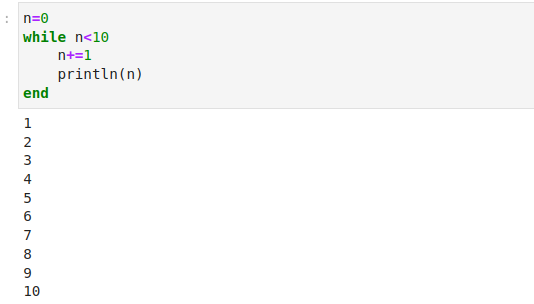{#fig:001 width=70%}
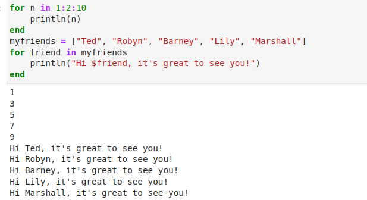{#fig:002 width=70%}

## Условные выражения 

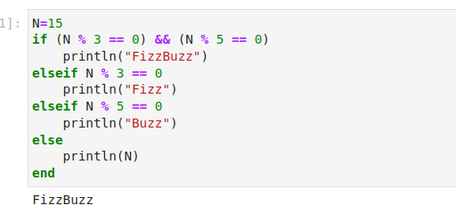{#fig:003 width=70%}
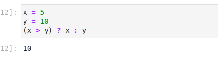{#fig:004 width=70%}

## Функции

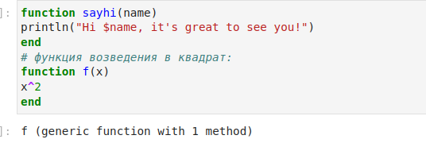{#fig:005 width=70%}
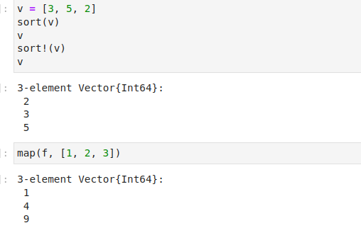{#fig:006 width=70%}

## Сторонние библиотеки (пакеты) в Julia

## Задание 1

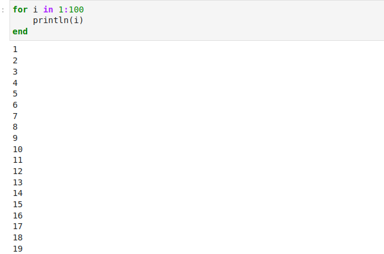{#fig:007 width=70%}
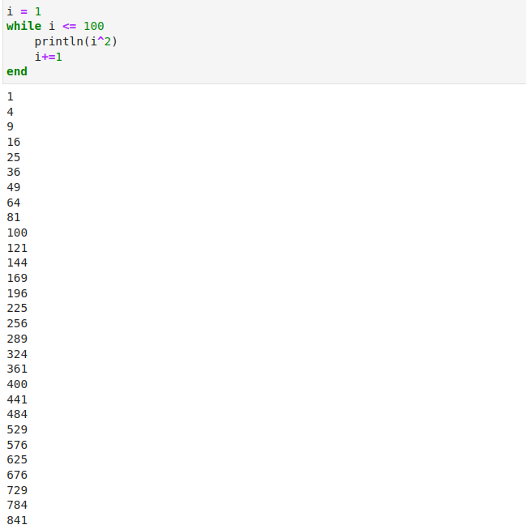{#fig:008 width=70%}
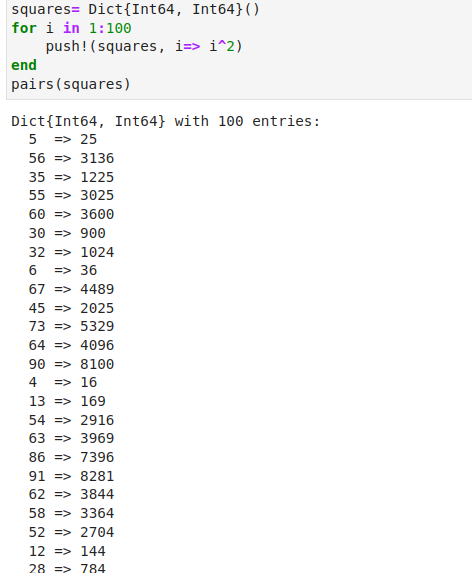{#fig:009 width=70%}
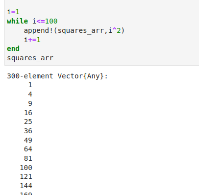{#fig:010 width=70%}

## Задание 2
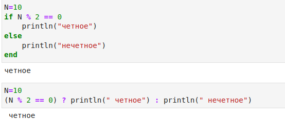{#fig:011 width=70%}

## Задание 3
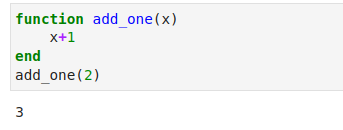{#fig:012 width=70%}

## Задание 4
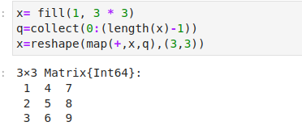{#fig:013 width=70%}

## Задание 5
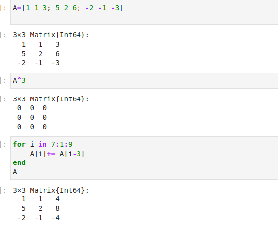{#fig:014 width=70%}

## Задание 6
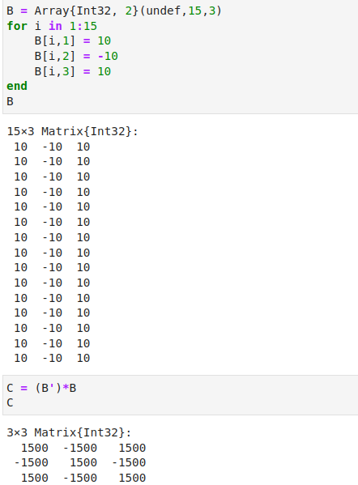{#fig:015 width=70%}

## Задание 7
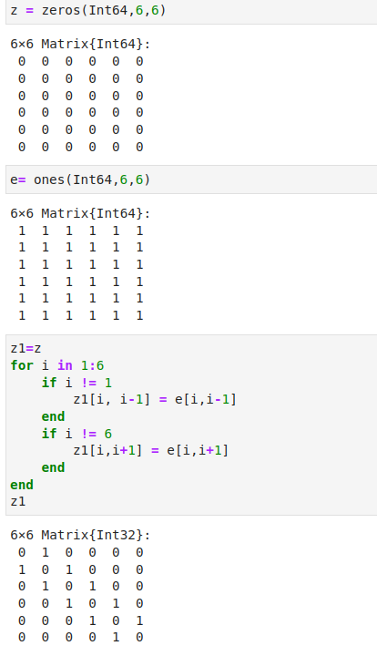{#fig:016 width=70%}
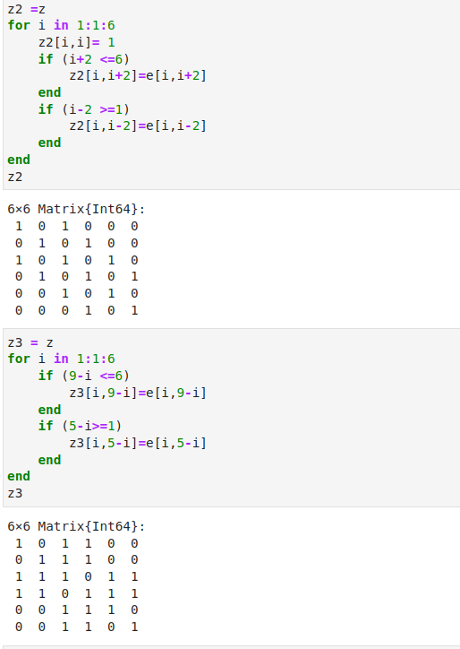{#fig:017 width=70%}
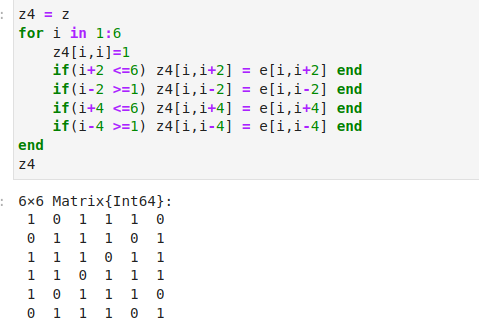{#fig:018 width=70%}

## Вывод
Мы освоили применение циклов функций и сторонних для Julia
пакетов для решения задач линейной алгебры и работы с матрицами.
