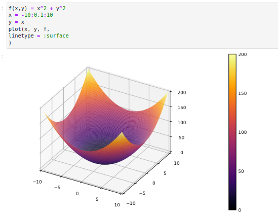
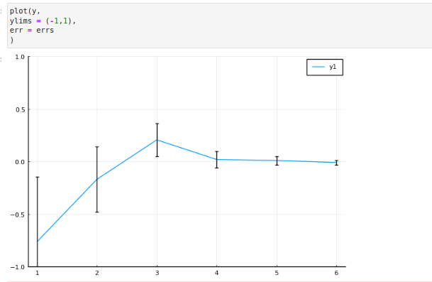

---
## Front matter
lang: ru-RU
title: Лабораторная работа 5
author:
  - Петрушов Дмитрий Сергеевич 1032212287
institute:
  - Российский университет дружбы народов, Москва, Россия
date: 2024

## i18n babel
babel-lang: russian
babel-otherlangs: english

## Formatting pdf
toc: false
toc-title: Содержание
slide_level: 2
aspectratio: 169
section-titles: true
theme: metropolis
header-includes:
 - \metroset{progressbar=frametitle,sectionpage=progressbar,numbering=fraction}
 - '\makeatletter'
 - '\beamer@ignorenonframefalse'
 - '\makeatother'
---

## Цель лабораторной работы

Основная цель работы — освоить синтаксис языка Julia для построения графиков.

# Выполнение лабораторной работы

## Основные пакеты для работы с графиками в Julia

{ #fig:001 width=100% height=100% }

## Основные пакеты для работы с графиками в Julia

{ #fig:002 width=100% height=100% }

## Опции при построении графика

{ #fig:003 width=100% height=100% }

## Опции при построении графика

{ #fig:004 width=100% height=100% }

## Точечный график

{ #fig:005 width=100% height=100% }

## Точечный график

{ #fig:006 width=100% height=100% }

## Точечный график

{ #fig:007 width=100% height=100% }

## Аппроксимация данных

{ #fig:008 width=100% height=100% }

## Аппроксимация данных

{ #fig:009 width=100% height=100% }

## Две оси ординат

{ #fig:010 width=100% height=100% }

## Полярные координаты

{ #fig:011 width=100% height=100% }

## Параметрический график

{ #fig:012 width=100% height=100% }

## Параметрический график

{ #fig:013 width=100% height=100% }

## График поверхности

{ #fig:014 width=100% height=100% }

## График поверхности

{ #fig:015 width=100% height=100% }

## Линии уровня

{ #fig:016 width=100% height=100% }

## Линии уровня

{ #fig:017 width=100% height=100% }

## Векторные поля

{ #fig:017 width=100% height=100% }

## Векторные поля

{ #fig:018 width=100% height=100% }

## Анимация

{ #fig:019 width=100% height=100% }

## Гипоциклоида

{ #fig:020 width=100% height=100% }

## Гипоциклоида

{ #fig:021 width=100% height=100% }

## Errorbars

{ #fig:022 width=100% height=100% }

## Errorbars

{ #fig:023 width=100% height=100% }

## Errorbars

{ #fig:024 width=100% height=100% }

## Подграфики

{ #fig:025 width=100% height=100% }

## Подграфики

{ #fig:026 width=100% height=100% }

## Подграфики

{ #fig:027 width=100% height=100% }

# Вывод

## Вывод

В ходе выполнения лабораторной работы был освоен синтаксис языка Julia для построения графиков.
