---
## Front matter
lang: ru-RU
title: Лабораторная работа 6
author: 
  - "Петрушов Дмитрий, 1032212287"
institute:
  - Российский университет дружбы народов, Москва, Россия
date: 2024 г.

## i18n babel
babel-lang: russian
babel-otherlangs: english

## Formatting pdf
toc: false
toc-title: Содержание
slide_level: 2
aspectratio: 169
section-titles: true
theme: metropolis
header-includes:
 - \metroset{progressbar=frametitle,sectionpage=progressbar,numbering=fraction}
---

# Цель работы
Основной целью работы является освоение специализированных пакетов для решения задач в 
непрерывном и дискретном времени.

# Выполнение 1 части

## Модель экспоненциального роста

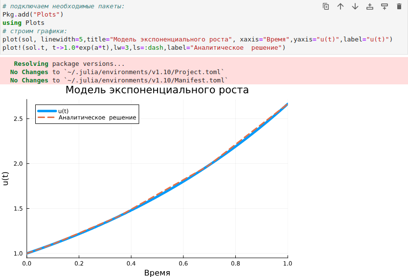{ #fig:001 width=100% height=100% }

## Модель экспоненциального роста

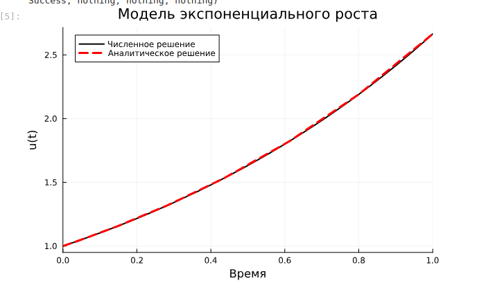{ #fig:002 width=100% height=100% }

## Система Лоренца

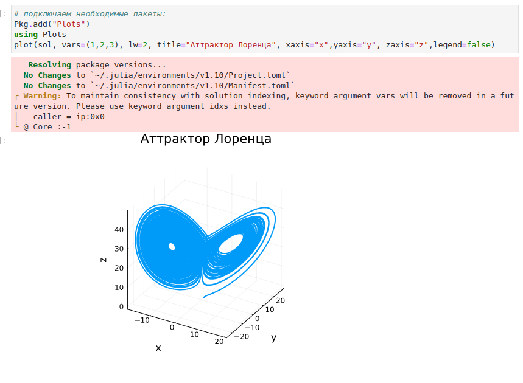{ #fig:003 width=100% height=100% }

## Система Лоренца

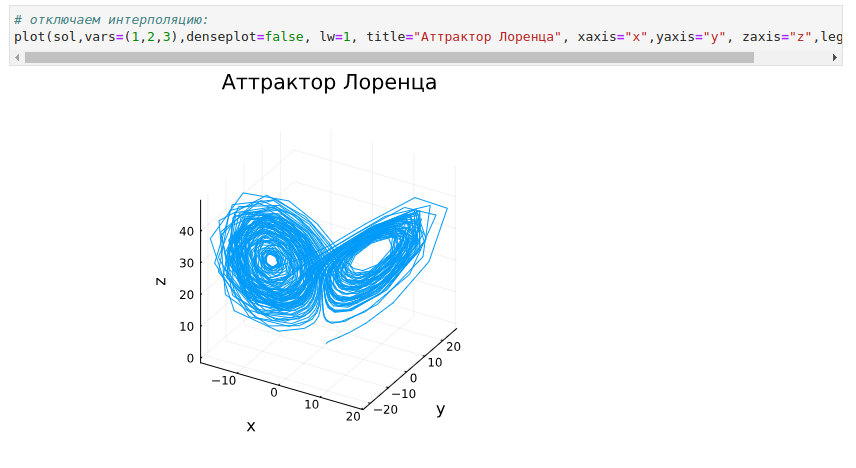{ #fig:004 width=100% height=100% }

## Модель Лотки–Вольтерры

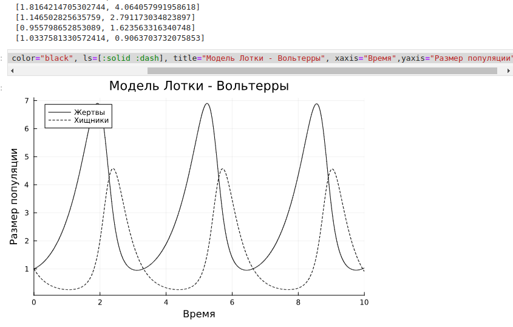{ #fig:005 width=100% height=100% }

## Модель Лотки–Вольтерры

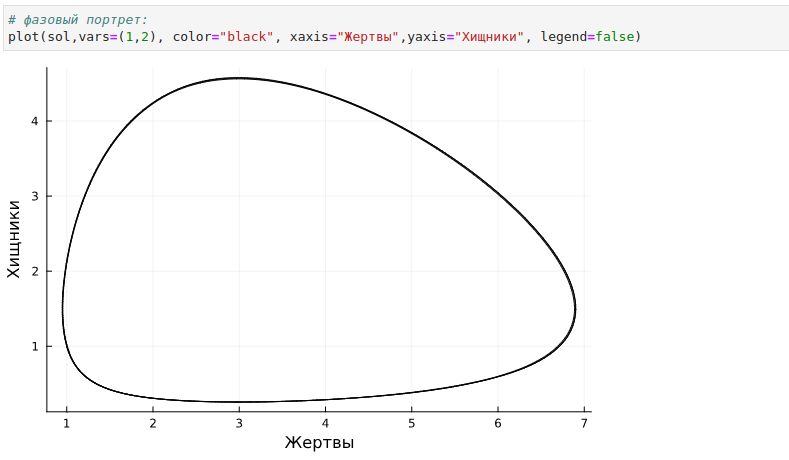{ #fig:006 width=100% height=100% }

# Самостоятельное выполнение

## Выполнение задания №1

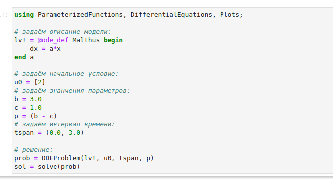{ #fig:007 width=100% height=100% }

## График №1

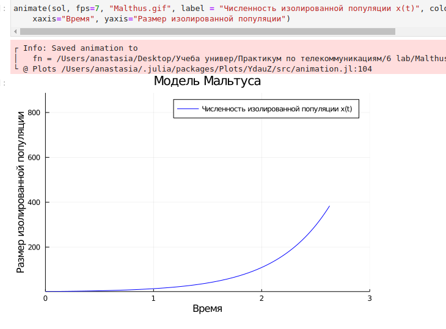{ #fig:008 width=100% height=100% }

## Выполнение задания №2

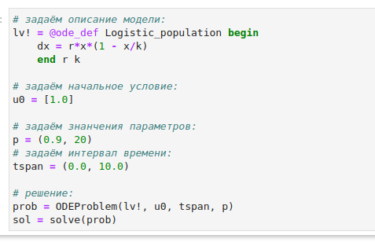{ #fig:009 width=100% height=100% }

## График №2

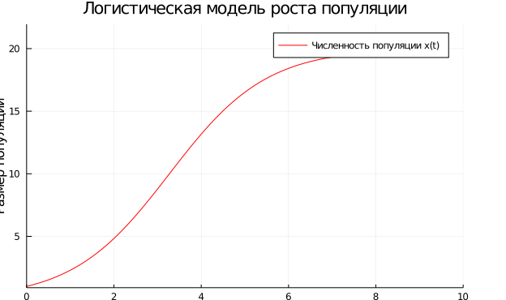{ #fig:010 width=100% height=100% }

## Выполнение задания №3

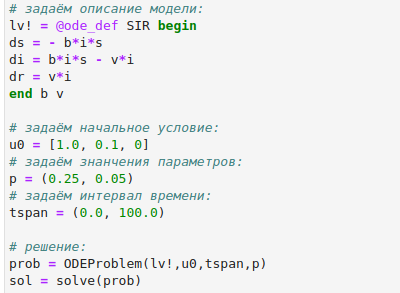{ #fig:011 width=100% height=100% }

## График №3

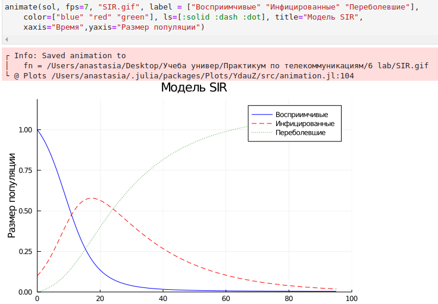{ #fig:012 width=100% height=100% }

## Выполнение задания №4 

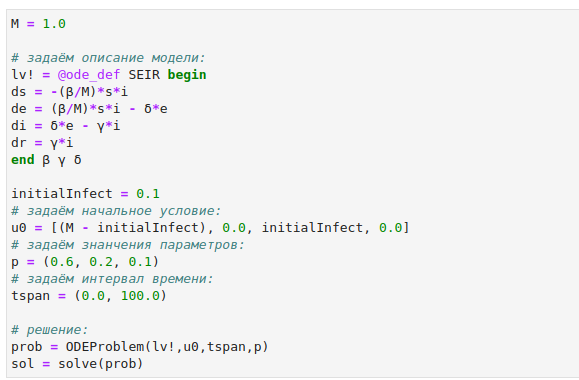{ #fig:013 width=100% height=100% }

## График №4

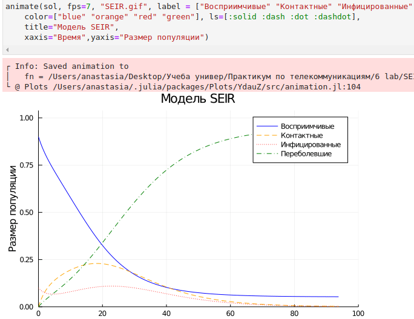{ #fig:014 width=100% height=100% }

## Выполнение задания №5

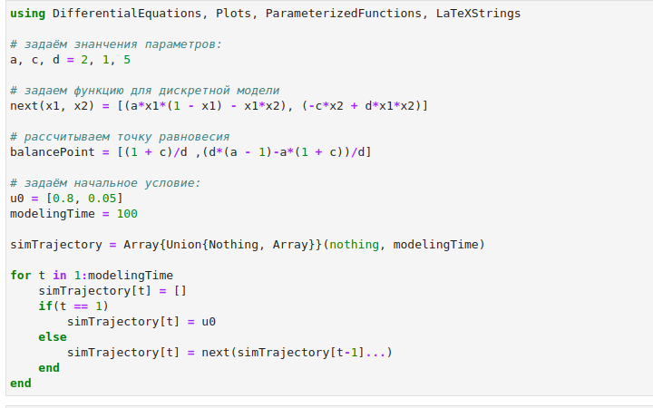{ #fig:015 width=100% height=100% }

## График №5

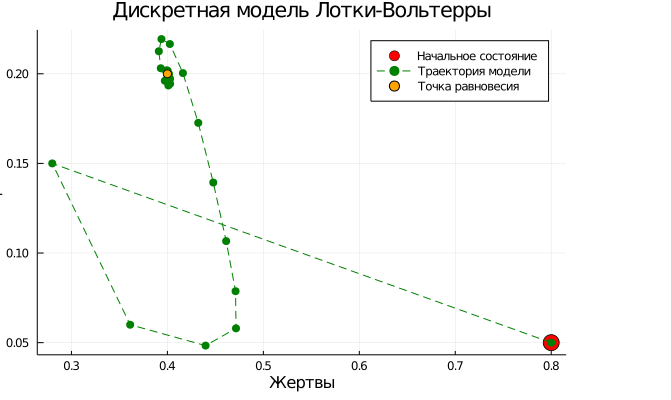{ #fig:016 width=100% height=100% }

## Выполнение задания №6

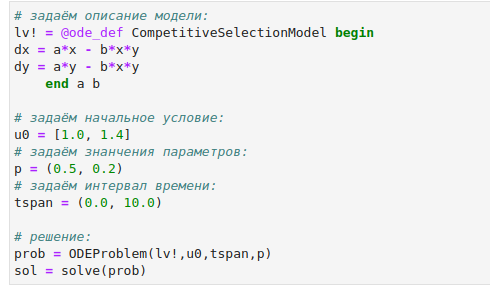{ #fig:017 width=100% height=100% }

## График №6

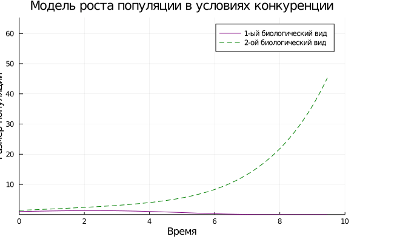{ #fig:018 width=100% height=100% }

## Выполнение задания №7

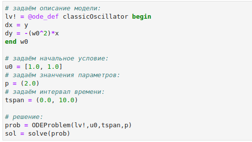{ #fig:019 width=100% height=100% }

## График №7

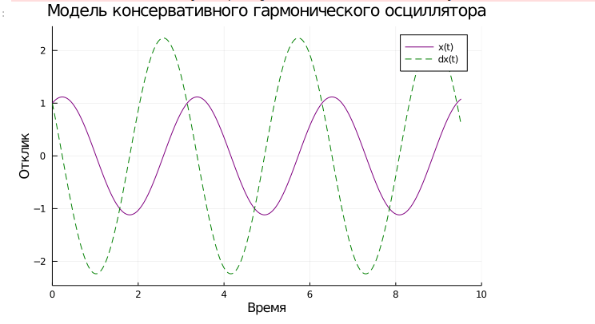{ #fig:020 width=100% height=100% }

## Выполнение задания №8

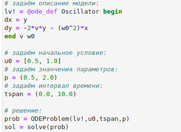{ #fig:021 width=100% height=100% }

## График №8

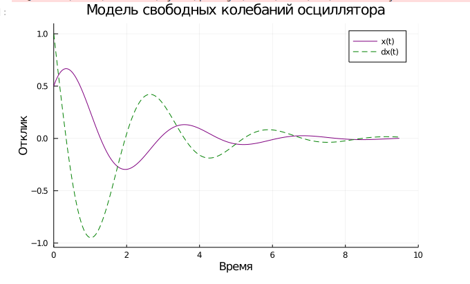{ #fig:022 width=100% height=100% }

# Выводы

В ходе выполнения лабораторной работы были освоены специализированные пакеты для  решения задач в непрерывном и дискретном времени.