---
## Front matter
title: "Отчет по лабораторной работе 6"
author: "Петрушов Дмитрий, 1032212287"

## Generic otions
lang: ru-RU
toc-title: "Содержание"

## Bibliography
bibliography: bib/cite.bib
csl: pandoc/csl/gost-r-7-0-5-2008-numeric.csl

## Pdf output format
toc: true # Table of contents
toc-depth: 2
lof: true # List of figures
lot: true # List of tables
fontsize: 12pt
linestretch: 1.5
papersize: a4
documentclass: scrreprt
## I18n polyglossia
polyglossia-lang:
  name: russian
  options:
	- spelling=modern
	- babelshorthands=true
polyglossia-otherlangs:
  name: english
## I18n babel
babel-lang: russian
babel-otherlangs: english
## Fonts
mainfont: PT Serif
romanfont: PT Serif
sansfont: PT Sans
monofont: PT Mono
mainfontoptions: Ligatures=TeX
romanfontoptions: Ligatures=TeX
sansfontoptions: Ligatures=TeX,Scale=MatchLowercase
monofontoptions: Scale=MatchLowercase,Scale=0.9
## Biblatex
biblatex: true
biblio-style: "gost-numeric"
biblatexoptions:
  - parentracker=true
  - backend=biber
  - hyperref=auto
  - language=auto
  - autolang=other*
  - citestyle=gost-numeric
## Pandoc-crossref LaTeX customization
figureTitle: "Рис."
tableTitle: "Таблица"
listingTitle: "Листинг"
lofTitle: "Список иллюстраций"
lotTitle: "Список таблиц"
lolTitle: "Листинги"
## Misc options
indent: true
header-includes:
  - \usepackage{indentfirst}
  - \usepackage{float} # keep figures where there are in the text
  - \floatplacement{figure}{H} # keep figures where there are in the text
---

# Цель работы

Основной целью работы является освоение специализированных пакетов для решения задач в 
непрерывном и дискретном времени.
 
# Выполнение лабораторной работы

## Решение обыкновенных дифференциальных уравнений

Вспомним, что обыкновенное дифференциальное уравнение (ОДУ) описывает изменение некоторой 
переменной u.

Для решения обыкновенных дифференциальных уравнений (ОДУ) в Julia можно использовать пакет 
diffrentialEquations.jl.

## Модель экспоненциального роста

Рассмотрим пример использования этого пакета для решение уравнения модели экспоненциального роста, 
описываемую уравнением, где a — коэффициент роста. 

Численное решение в Julia будет иметь следующий вид, а также график, 
соответствующий полученному решению (рис. [-@fig:001]):

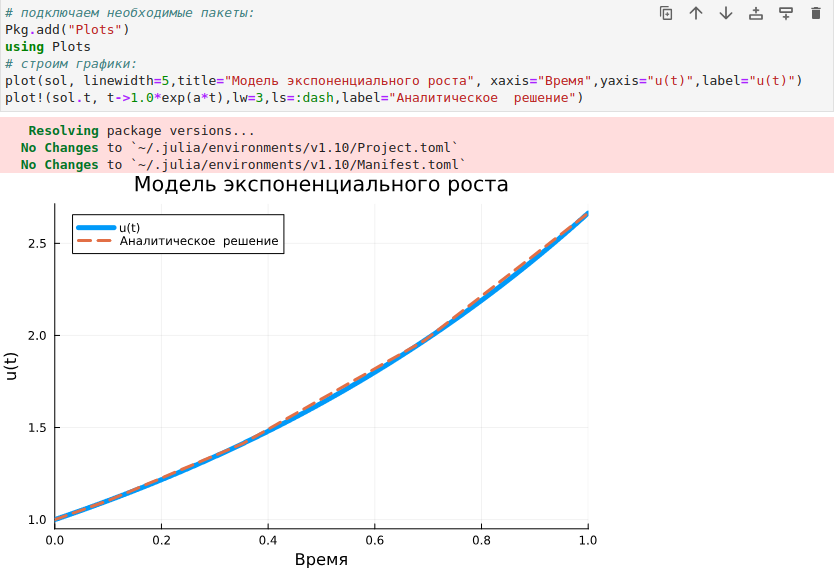{ #fig:001 width=100% height=100% }

При построении одного из графиков использовался вызов sol.t, чтобы захватить массив моментов 
времени. Массив решений можно получить, воспользовавшись sol.u.

Если требуется задать точность решения, то можно воспользоваться параметрами abstol 
(задаёт близость к нулю) и reltol (задаёт относительную точность). По умолчанию эти параметры 
имеют значение abstol = 1e-6 и reltol = 1e-3.

Для модели экспоненциального роста (рис. [-@fig:002]):

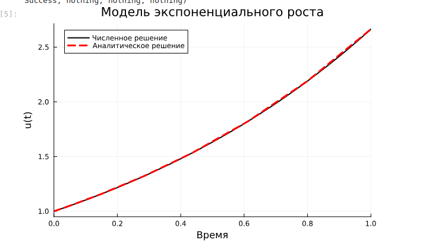{ #fig:002 width=100% height=100% }

## Система Лоренца

Динамической системой Лоренца является нелинейная автономная система обыкновенных дифференциальных 
уравнений третьего порядка.

Система получена из системы уравнений Навье–Стокса и описывает движение воздушных потоков в 
плоском слое жидкости постоянной толщины при разложении скорости течения и температуры в 
двойные ряды Фурье с последующем усечением до первых-вторых гармоник.

Решение системы неустойчиво на аттракторе, что не позволяет применять классические численные методы на 
больших отрезках времени, требуется использовать высокоточные вычисления.

Численное решение в Julia будет иметь следующий вид (рис. [-@fig:003]):

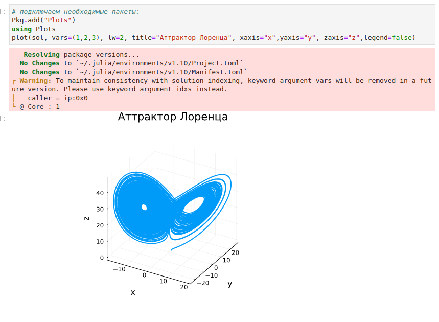{ #fig:003 width=100% height=100% }

Можно отключить интерполяцию (рис. [-@fig:004]):

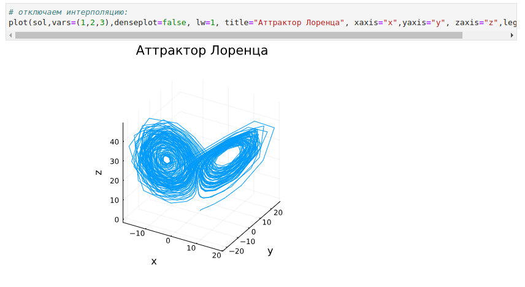{ #fig:004 width=100% height=100% }

## Модель Лотки–Вольтерры

Модель Лотки–Вольтерры описывает взаимодействие двух видов типа «хищник – жертва».

Численное решение в Julia будет иметь следующий вид (рис. [-@fig:005]):

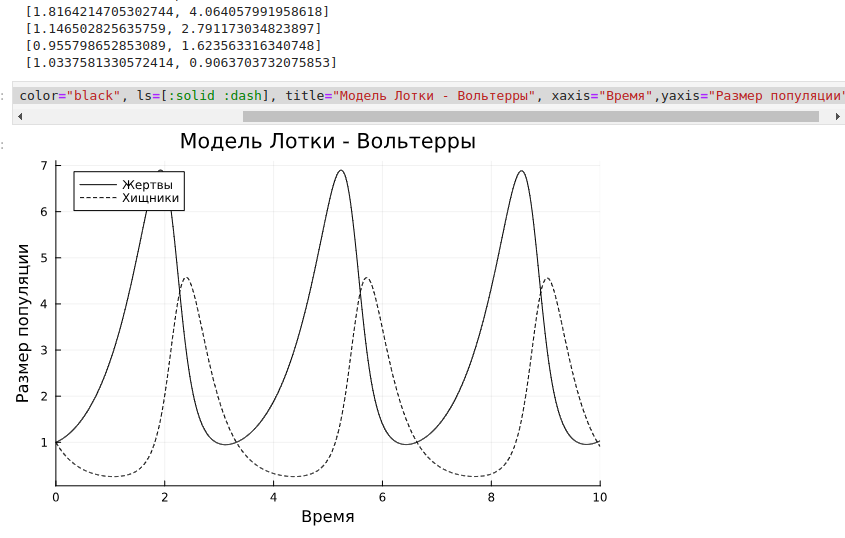{ #fig:005 width=100% height=100% }

Фазовый портрет (рис. [-@fig:006]):

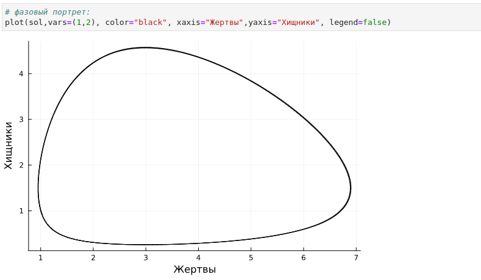{ #fig:006 width=100% height=100% }

## Самостоятельное выполнение

Выполнение задания №1 (рис. [-@fig:007]):

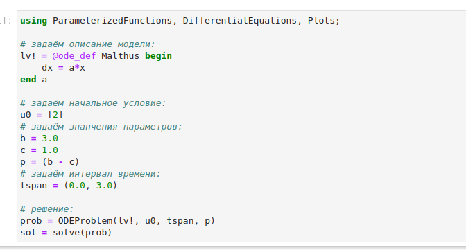{ #fig:007 width=100% height=100% }

График №1 (рис. [-@fig:008]):

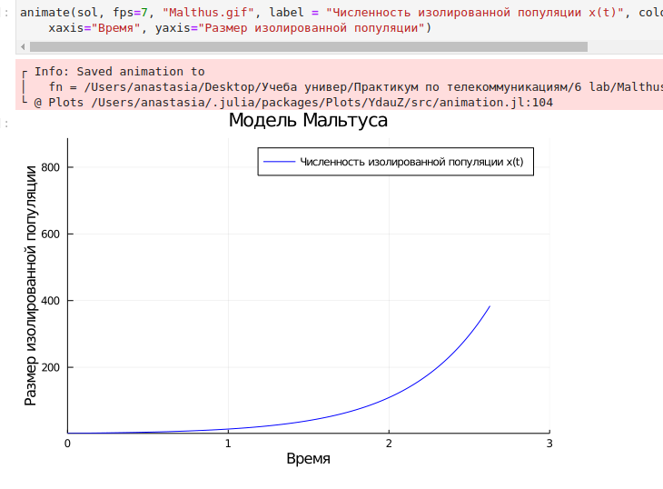{ #fig:008 width=100% height=100% }

Выполнение задания №2 (рис. [-@fig:009]):

{ #fig:009 width=100% height=100% }

График №2 (рис. [-@fig:010]):

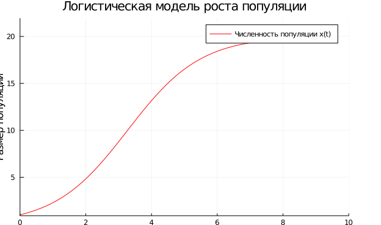{ #fig:010 width=100% height=100% }

Выполнение задания №3 (рис. [-@fig:011]):

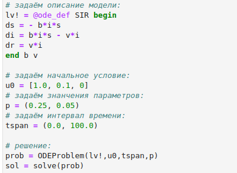{ #fig:011 width=100% height=100% }

График №3 (рис. [-@fig:012]):

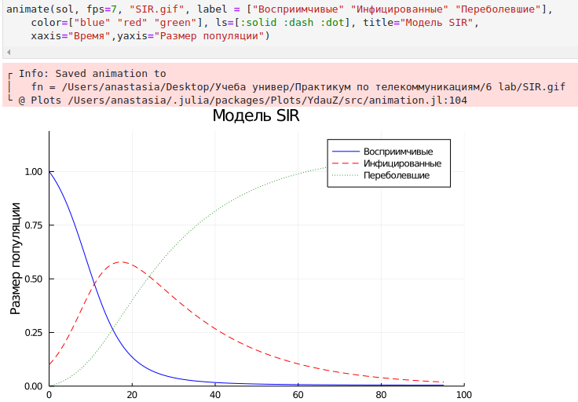{ #fig:012 width=100% height=100% }

Выполнение задания №4 (рис. [-@fig:013]):

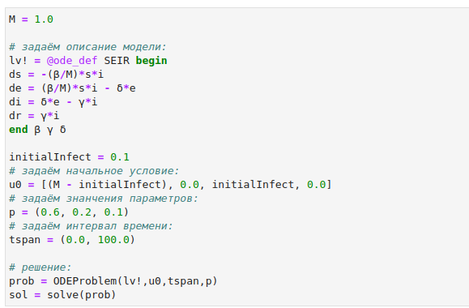{ #fig:013 width=100% height=100% }

График №4 (рис. [-@fig:014]):

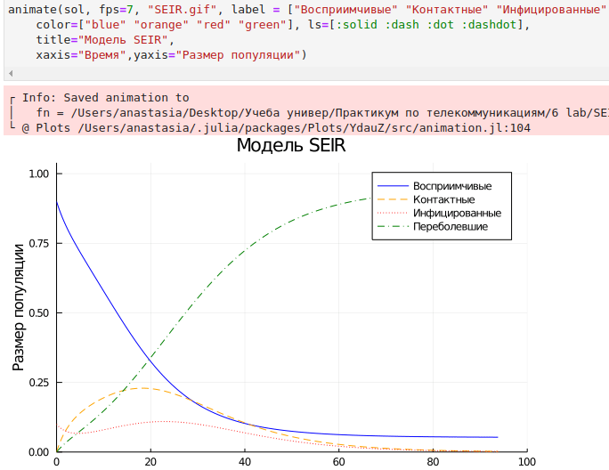{ #fig:014 width=100% height=100% }

Выполнение задания №5 (рис. [-@fig:015]):

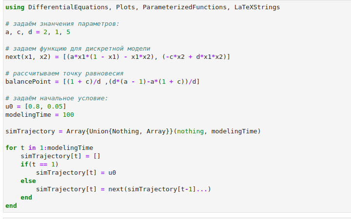{ #fig:015 width=100% height=100% }

График №5 (рис. [-@fig:016]):

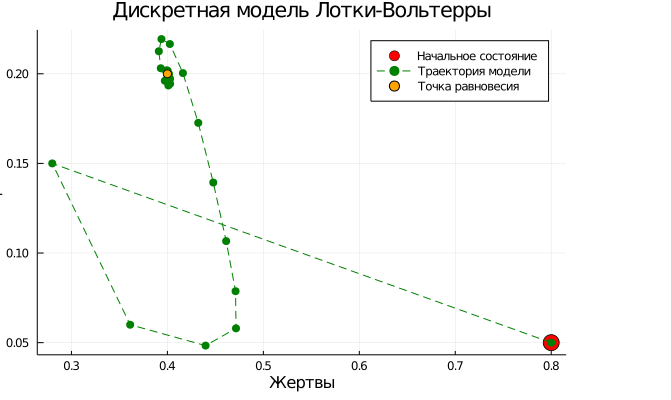{ #fig:016 width=100% height=100% }

Выполнение задания №6 (рис. [-@fig:017]):

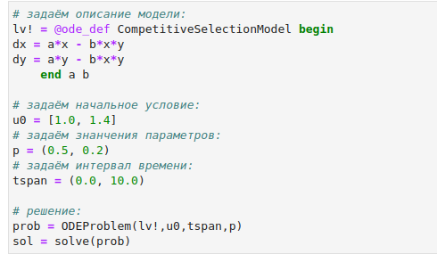{ #fig:017 width=100% height=100% }

График №6 (рис. [-@fig:018]):

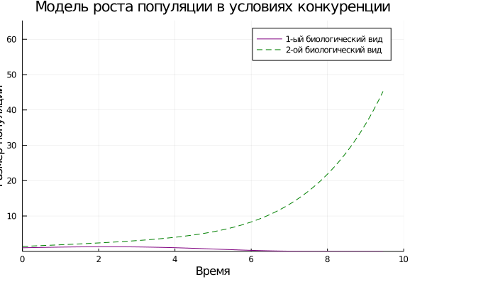{ #fig:018 width=100% height=100% }

Выполнение задания №7 (рис. [-@fig:019]):

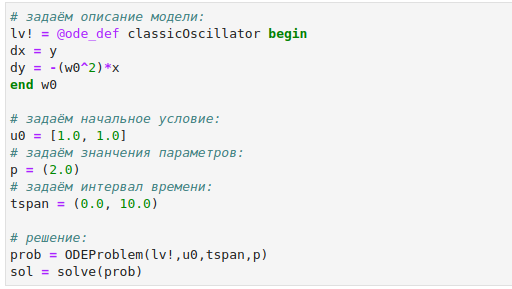{ #fig:019 width=100% height=100% }

График №7 (рис. [-@fig:020]):

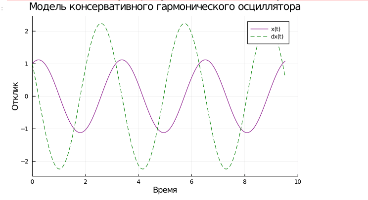{ #fig:020 width=100% height=100% }

Выполнение задания №8 (рис. [-@fig:021]):

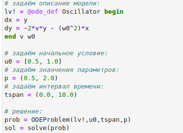{ #fig:021 width=100% height=100% }

График №8 (рис. [-@fig:022]):

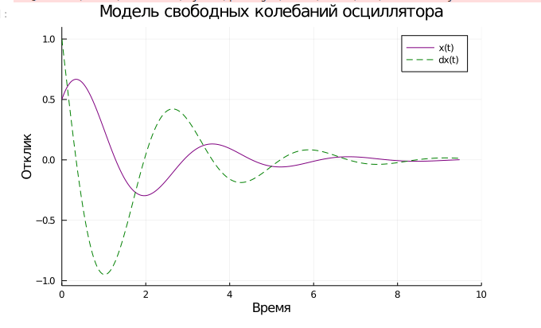{ #fig:022 width=100% height=100% }

# Вывод

В ходе выполнения лабораторной работы были освоены специализированные пакеты для 
решения задач в непрерывном и дискретном времени.

# Список литературы{.unnumbered}

::: {#refs}
:::