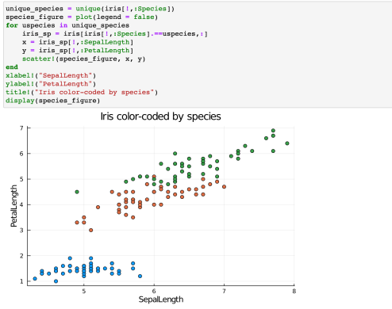

---
## Front matter
lang: ru-RU
title: Лабораторная работа 7
author: 
  - "Петрушов Дмитрий, 1032212287"
institute:
  - Российский университет дружбы народов, Москва, Россия
date: 2024 г.

## i18n babel
babel-lang: russian
babel-otherlangs: english

## Formatting pdf
toc: false
toc-title: Содержание
slide_level: 2
aspectratio: 169
section-titles: true
theme: metropolis
header-includes:
 - \metroset{progressbar=frametitle,sectionpage=progressbar,numbering=fraction}
---

# Цель работы
Основной целью работы является изучение специализированных пакетов Julia для обработки данных.  

# Выполнение лабораторной работы

## Считывание данных

{ #fig:001 width=100% height=100% }

## Пример

{ #fig:002 width=100% height=100% }

## Поиск "julia" со строчной буквы

{ #fig:003 width=100% height=100% }

## Построчное считывание данных

{ #fig:004 width=100% height=100% }

## Запись данных в файл

{ #fig:005 width=100% height=100% }

## Словари 

{ #fig:006 width=100% height=100% }

## Пример работы словаря

{ #fig:007 width=100% height=100% }

## DataFrames

{ #fig:008 width=100% height=100% }

## RDatasets

{ #fig:009 width=100% height=100% }

## Получение основных статических сведений о каждом столбце в наборе данных

{ #fig:016 width=100% height=100% }

## Работа с переменными отсутствующего типа (Missing Values)

{ #fig:010 width=100% height=100% }

## Пример работы с данными, среди которых есть данные с отсутствующим типом

{ #fig:011 width=100% height=100% }

## FileIO

{ #fig:012 width=100% height=100% }

## Обработка данных: стандартные алгоритмы машинного обучения в Julia. Кластеризация данных. Метод k-средних

{ #fig:013 width=100% height=100% }

## Построение графика без "артефактов"

{ #fig:014 width=100% height=100% } 

## Кластеризация данных. Метод k ближайших соседей

{ #fig:015 width=100% height=100% }

## Обработка данных. Метод главных компонент

{ #fig:033 width=100% height=100% }

## Обработка данных. Линейная регрессия

{ #fig:016 width=100% height=100% }

## Сравнение

{ #fig:017 width=100% height=100% }

# Самостоятельное выполнение

## Решение задания №1

{ #fig:018 width=100% height=100% }

## Решение задания №1

{ #fig:019 width=100% height=100% }

## Решение задания №1

{ #fig:020 width=100% height=100% }

## Решение задания №2-1

{ #fig:021 width=100% height=100% }

## Решение задания №2-1

{ #fig:022 width=100% height=100% }

## Решение задания №2-2

{ #fig:023 width=100% height=100% }

## Решение задания №2-2a

{ #fig:024 width=100% height=100% }

## Решение задания №2-2b

{ #fig:025 width=100% height=100% }

## Решение задания №2-2c

{ #fig:026 width=100% height=100% }

# Выводы

В ходе выполнения лабораторной работы были изучены специализированные пакеты Julia для обработки данных.